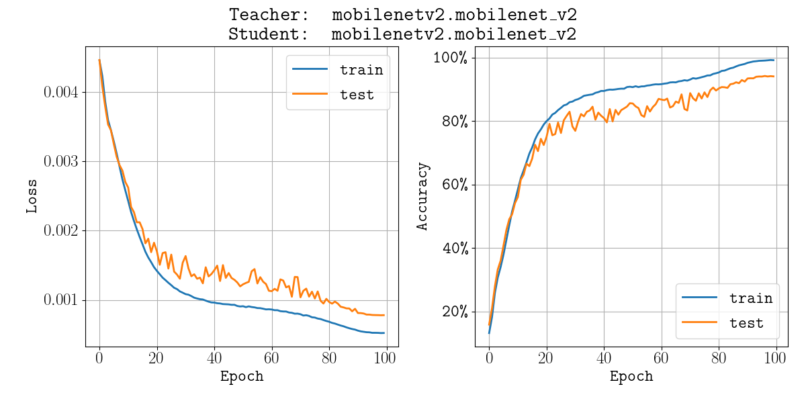

# Quantized Ensemble Distillation

A working directory for creating an ensemble of quantized models.
The idea is to create a set of aggressively quantized models and train them using distillation.
The hope is that the ensemble will be much smaller (and maybe faster), while maintaining accuracy.

## Requirements

This project is currently working with the CIFAR10 data.
That means it needs models pretrained on CIFAR10.
I use [huyvnphan's models](https://github.com/huyvnphan/PyTorch_CIFAR10), but I slightly changed the paths in there to be a little more convenient for my purposes.

To work with the current code-base, you should clone [my fork of the PyTorch_CIFAR10](https://github.com/z-a-f/PyTorch_CIFAR10)

## Demo run

```shell
$> python cifar10_train_ens.py config/mobilenetv2.yaml config/mobilenetv2.yaml --seed 0 --save_to results
# Long training
$> python plot_json.py results/results_mobilenetv2.mobilenet_v2.json --save_to imgs/mobilenetv2_self_distill
```



## TODO list

- [X] Create a parameterized `main` file
- [ ] Add other YAML model files
  - [ ] densenet121
  - [ ] densenet161
  - [ ] densenet169
  - [X] googlenet
  - [ ] inception_v3
  - [X] mobilenet_v2
  - [ ] resnet18
  - [ ] resnet34
  - [ ] resnet50
  - [ ] vgg11_bn
  - [ ] vgg13_bn
  - [ ] vgg16_bn
  - [ ] vgg19_bn
- [ ] Write a training/evaluation routine for a set of students (not a single one)
- [ ] PUT EVERYTHING UNDER CORRECT FOLDERS!!!!
- [ ] Make models for QAT
